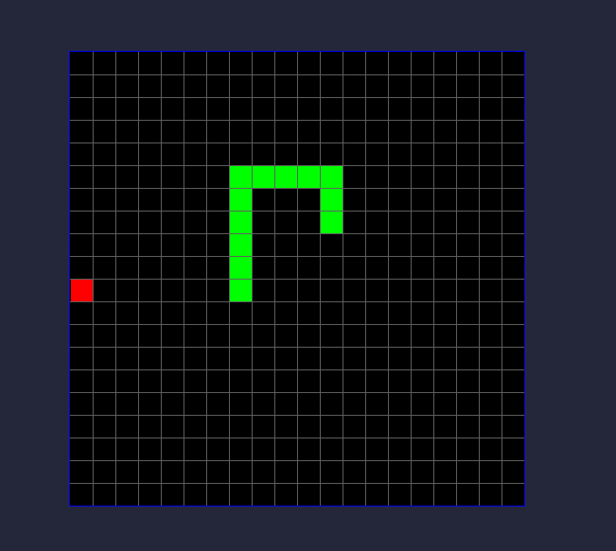

# snake 
It's a simple adaptation of snake game written in pygame. 


## installation

Clone repository 
```shell
git clone https://github.com/bankubanku/snake.git
```

Go to cloned repository
```shell
cd snake
```

Install requirements
```shell
pip install -r requirements.txt
```

You can run this game typing
```
python snake.py
``` 
